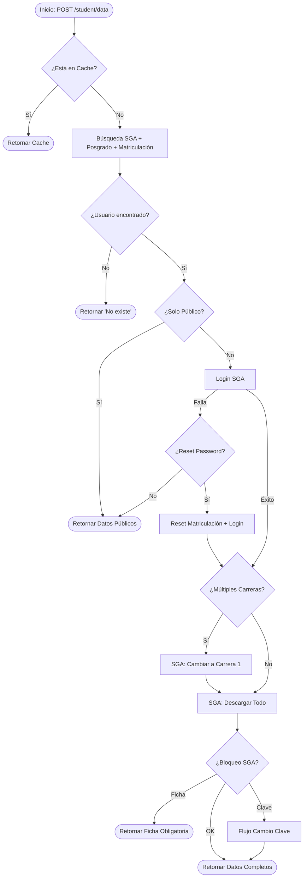

# Flujo de Lógica: unemi-api

Este diagrama detalla cómo se procesan las peticiones en el `StudentService`.

### Casos Principales
1.  **Cédula no registrada**: Se detecta en la búsqueda inicial.
2.  **Solo consulta pública**: No requiere contraseña, usa datos de "recuperación de cuenta".
3.  **Consulta privada completa**: Requiere login. Si falla y se habilita `reset_password`, intenta forzar el acceso con la clave por defecto.
4.  **Bloqueos administrativos**: Detectados post-login (Ficha o cambio de clave obligatorio).
